# Radar Target Generation and Detection Project

## Introduction
The goal of this project is to simulate a Frequency Modulated Continuous Wave (FMCW) Radar and process the signal to detect the range and velocity of a target. The implementation is done in MATLAB and the project is part of the Sensor Fusion Nanodegree from Udacity. 

The main parts of the project are:
1. Design the FMCW waveform based on the system requirements.
1. Define the range and velocity of the simulated target.
1. Simulate the transmit and receive a signal to determine the beat signal
1. Perform Range FFT on the beat signal to determine the Range
1. Implement a CFAR algorithm to filter the output of 2nd FFT and display the target.


Image Source: Udacity - Sensor Fusion Nanodegreeunderstanding

## Implementation

### FMCW Waveform Design
The designed FMCW radar must fulfill the following requirements:
| Parameter           | value  |
|---------------------|:------:|
| Frequency           | 77 GHz |
| Range Resolution    |   1 m  |
| Max Range           |  200 m |
| Max Velocity        | 70 m/s |
| Velocity Resolution | 3 m/s  |


#### Bandwidth
The range resolution is proportional to the bandwidth. Considering range resolution of one meter, the bandwidth can be calculated using the following expression.

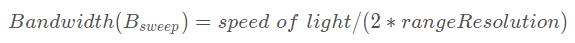

#### Chirp period (Tchirp)
The chirp period must be at least a few times higher than the round trip time. The worst case is when the target is located at the maximum range. In this project, a chirp period of 5.5 times the maximum round trip time is used. The equation is presented below.

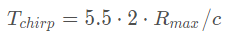


#### Slope
Finally, the slope of the signal is basically the bandwidth divided by the frequency.

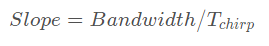

#### Matlab implementation
The calculation for the parameters described above is implemented using the code below.

```Matlab
B = c / (2 * d_res);
Tchirp = (2 * max_range * 5.5) / c;
slope = B / Tchirp;
```

The results are:
| Parameter           | value       |
|---------------------|------------:|
| Bandwidth           | 150 MHz     |
| Chirp Period        | 7.33 us     |
| Slope               | 20.5 MHz/us |


### Simulation Loop
In the simulation loop, for every time delta, the position of the target is updated, and the radar Tx and Rx are updated according to the fundamental equation that describes the FMCW signal. Finally, the Tx and Rx are mixed to generate the beat signal that is latter processed for target detection.

The Tx and Rx equations are described as follows:

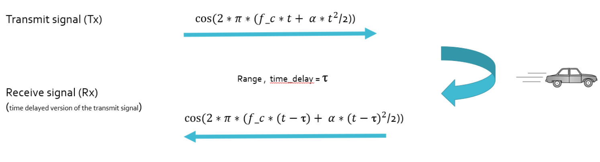 
Source: Udacity Sensor Fusion Nanodegree

The MATLAB implementation is

```Matlab
for i=1:length(t)         
    %For each time stamp update the Range of the Target for constant velocity.
    tpos = ini_pos + (t(i) * tvel);
    delay = 2*tpos/c; % time for the signal propagation considering current target position.

    %For each time sample we need update the transmitted and
    %received signal. 
    Tx(i) = cos(2*pi*((fc*t(i)) + (slope*t(i)^2)/2));
    Rx(i) = cos(2*pi*( fc*(t(i)-delay) + (slope*(t(i) - delay)^2)/2 ));
    
    %Now by mixing the Transmit and Receive generate the beat signal
    %This is done by element wise matrix multiplication of Transmit and
    %Receiver Signal
    Mix(i) = Tx(i).*Rx(i);
end
```

### Range FFT (1st FFT)
Applying the Fast Furrier Transformation on the mixed signal, it is possible to visualize the response in the frequency domain, that is proportional to the target's position. The plot below shows the target is located in the 100m range.

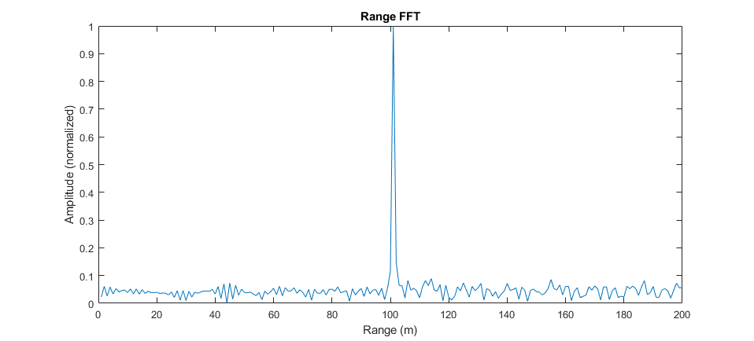


### Range Doppler Map (RDM)
The Range Doppler Map is calculated by applying two consecutive Fast Furrier Transformation. The result can be visualized in the 3D plot below, where the X, Y, and Z coordinates represent the Range, Velocity and Signal amplitude respectively.


### 2D CFAR
To filter the signal and identify the location of the target, a technique known as Cell Averaging CFAR (CA-CFAR) is used. In short, the threshold valued is based on the values of its surrounding.
To estimate the threshold value for the Cell Under Test (CUT) the average of the values in the Training Cells are calculated without considering the Guard Cells. This is done in both range and velocity dimensions, and can be visualized in the image below: 

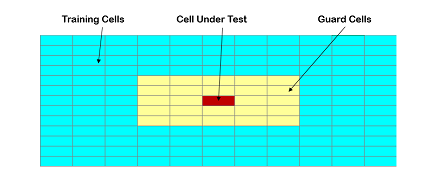

Image source: https://la.mathworks.com/help/phased/examples/constant-false-alarm-rate-cfar-detection.html


The values selected for the Training Cells and Guard Cells, in both range and velocity dimensions are:
```Matlab
Tr = 10;
Gr = 4;
Td = 8;
Gd = 4;
```

The code implemented  to iterate through the RDM values and calculate the threshold is displayed below:
```Matlab
for i = (1+Gr+Tr):((Nr/2)-(Gr+Tr))
    for j = (1+Gd+Td):((Nd)-(Gd+Td))
        %Create a vector to store noise_level for each iteration on training cells
        noise_level = zeros(1,1);
        % loop through the training cells
        for p = i-(Gr+Tr):i+(Gr+Tr)
            for q = j-(Gd+Td):j+(Gd+Td)
                %skip guard cells
                if(abs(i-p)>Gr || abs(j-q)>Gd)
                    noise_level = noise_level + db2pow(RDM(p,q));
                end
            end
        end
        % calculate average        
        threshold = pow2db(noise_level/training_size);
        threshM(i,j) = threshold;
        offsetM(i,j) = threshM(i,j) + offset;
        if (RDM(i,j) > threshold + offset)
            CFAR2D(i,j) = 1;
        else
            CFAR2D(i,j) = 0;
        end
    end
end
```

Depending on the size of the training and guard cells, the output matrix has smaller size, since the borders are not considered. To avoid this problem, all matrix are initiallized with zero values to keep the final dimension equal to the RDM matrix.
```Matlab
CFAR2D = zeros(size(RDM));
threshM = zeros(size(RDM));
offsetM = zeros(size(RDM));
```

The calculated threshold values including the offset can be visualized in the following image:

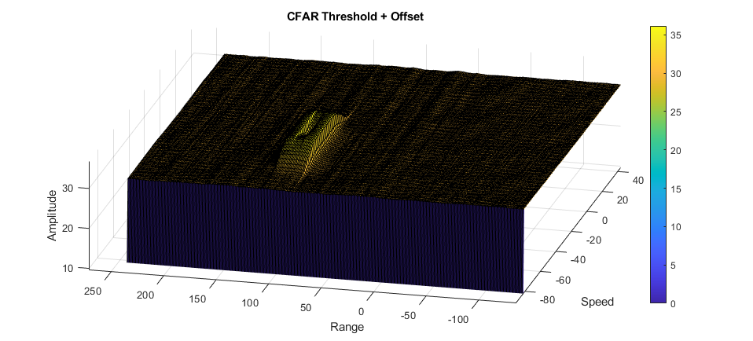

Applying the threshold to the RDM matrix, the following threshold block is generated.

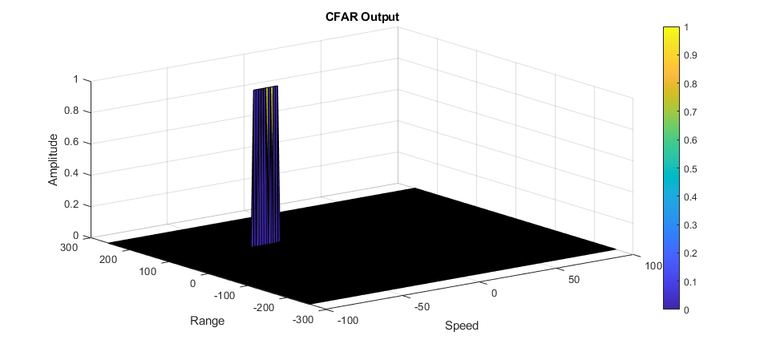

## Results

Using the signal processing described, the target can be visually identified in the RDM matrix with values very close to the defined range of 100 meters and a velocity of -40 meters per second.

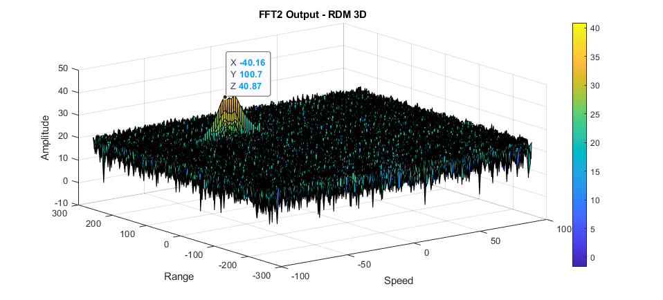

By applying the CA-CFAR dynamic filter, a thresholded block is generated, and can be visualized in the following pictures.

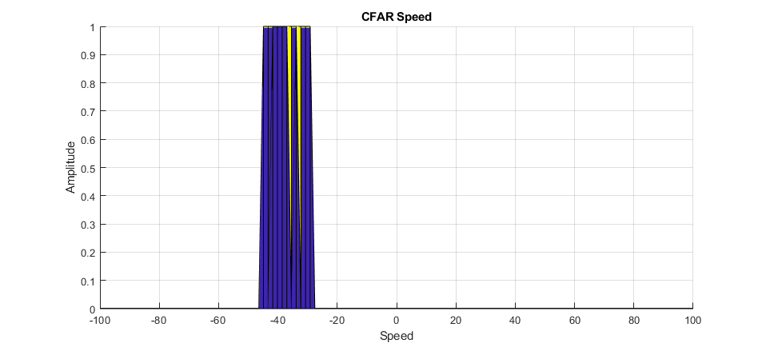
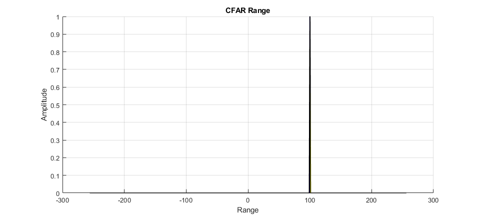

## Conclusion

Implementing all the steps in this project allows having  a good understanding of what is necessary to process the output of radar signals. 
The approach uses basic techniques that provide a foundation knowledge necessary before considering more advanced algorithms.
Using simulations in MATLAB is good for quick implementation and learning purposes. The scope of future activities include working with real radar sensors and explore more advanced techniques to filter the signal.